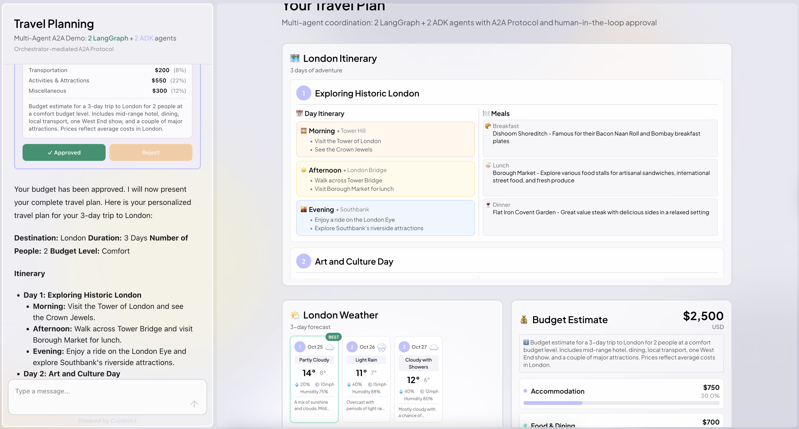

# Mental Health Booking Assistant

A multi-agent demonstration showing how therapist intake, availability, care planning, and cost conversations can be orchestrated with AG-UI and the A2A middleware. Four specialized agents (LangGraph + ADK) collaborate with an orchestrator to support therapists and care teams.



## Quick Start

### Prerequisites

- Node.js 18+
- Python 3.10+
- [Google API Key](https://aistudio.google.com/app/apikey)
- [OpenAI API Key](https://platform.openai.com/api-keys)

### Setup

1. Install frontend dependencies:

```bash
npm install
```

2. Install Python dependencies:

```bash
cd agents
python -m venv .venv
source .venv/bin/activate  # On Windows: .venv\Scripts\activate
pip install -r requirements.txt
```

3. Configure environment variables:

```bash
cp .env.example .env
# Edit .env and add your GOOGLE_API_KEY and OPENAI_API_KEY
```

4. Start all services:

```bash
npm run dev
```

This starts:

- UI on `http://localhost:3000`
- Orchestrator on `http://localhost:9000`
- Care Plan Agent on `http://localhost:9001`
- Insurance Agent on `http://localhost:9002`
- Resources Agent on `http://localhost:9003`
- Availability Agent on `http://localhost:9005`

## Usage

Ask the assistant to support a therapist, e.g.: "Help me onboard a new anxiety client on Tuesdays" or "Find trauma-focused therapists with evening openings and outline the care plan".

The orchestrator will coordinate the agents to:

1. Collect intake information (client name, primary concern, goals, logistics)
2. Generate a multi-week therapy care plan
3. Surface therapist availability and telehealth options
4. Compile supportive resources for homework and crisis support
5. Estimate costs and request human confirmation

All agent interactions are visible in the UI through the A2A message flow visualization.

## What This Demonstrates

This experience highlights cross-framework collaboration for mental health operations:

### LangGraph Agents (Python + OpenAI)

- **Care Plan Agent** (Port 9001) – Builds a structured multi-week therapy roadmap

### ADK Agents (Python + Gemini)

- **Insurance Agent** (Port 9002) – Estimates monthly costs and coverage details
- **Resources Agent** (Port 9003) – Curates self-guided supports and crisis resources
- **Availability Agent** (Port 9005) – Summarizes therapist openings and telehealth notes

### Orchestrator

- **Coordinator Agent** (Port 9000) – Manages intake, agent messaging, and HITL approvals via A2A middleware

The demo includes structured JSON responses, generative UI, human-in-the-loop approvals, and domain-specific orchestration.

## Architecture

```
┌──────────────────────────────────────────┐
│ Next.js UI (CopilotKit)                  │
└────────────┬─────────────────────────────┘
             │ AG-UI Protocol
┌────────────┴─────────────────────────────┐
│ A2A Middleware                           │
│ - Routes messages between agents         │
└──────┬───────────────────────────────────┘
       │ A2A Protocol
       │
       ├─────► LangGraph Agent (OpenAI)
       │       └── Care Plan (9001)
       │
       └─────► ADK Agents (Gemini)
               ├── Insurance (9002)
               ├── Resources (9003)
               └── Availability (9005)
       ▲
       │
┌──────┴──────────┐
│ Orchestrator    │
│ (Port 9000)     │
└─────────────────┘
```

## Project Structure

```
mental-health-assistant/
├── app/
│   ├── api/copilotkit/route.ts       # A2A middleware setup
│   └── page.tsx                      # Main UI workspace
│
├── components/
│   ├── a2a/                          # A2A message components
│   ├── therapy-chat.tsx              # Chat orchestration
│   ├── CarePlanCard.tsx              # Care plan display
│   ├── AvailabilityCard.tsx          # Therapist availability
│   ├── CostBreakdownCard.tsx         # Financial overview
│   └── ResourceLibrary.tsx           # Supportive resource list
│
├── agents/                           # Python agents
│   ├── orchestrator.py               # Orchestrator (9000)
│   ├── care_plan_agent.py            # LangGraph care planning (9001)
│   ├── insurance_agent.py            # ADK insurance estimator (9002)
│   ├── resources_agent.py            # ADK resource curator (9003)
│   └── availability_agent.py         # ADK availability summarizer (9005)
│
└── .env.example
```

## Technologies

- **Frontend**: Next.js, CopilotKit, AG-UI Client, Tailwind CSS
- **Backend**: Google ADK (Gemini), LangGraph (OpenAI), FastAPI
- **Protocols**: A2A (agent-to-agent), AG-UI (agent-UI)
- **Middleware**: @ag-ui/a2a-middleware

## Troubleshooting

**Agents not connecting?** Check that each Python agent is running and reachable on the ports above.

**Missing API keys?** Ensure `.env` contains `GOOGLE_API_KEY` and `OPENAI_API_KEY`.

**Python issues?** Activate the virtual environment: `cd agents && source .venv/bin/activate`.

## Learn More

- [AG-UI Protocol](https://docs.ag-ui.com)
- [A2A Protocol](https://github.com/agent-matrix/a2a)
- [Google ADK](https://google.github.io/adk-docs/)
- [LangGraph](https://langchain-ai.github.io/langgraph/)
- [CopilotKit](https://docs.copilotkit.ai)

## License

MIT
